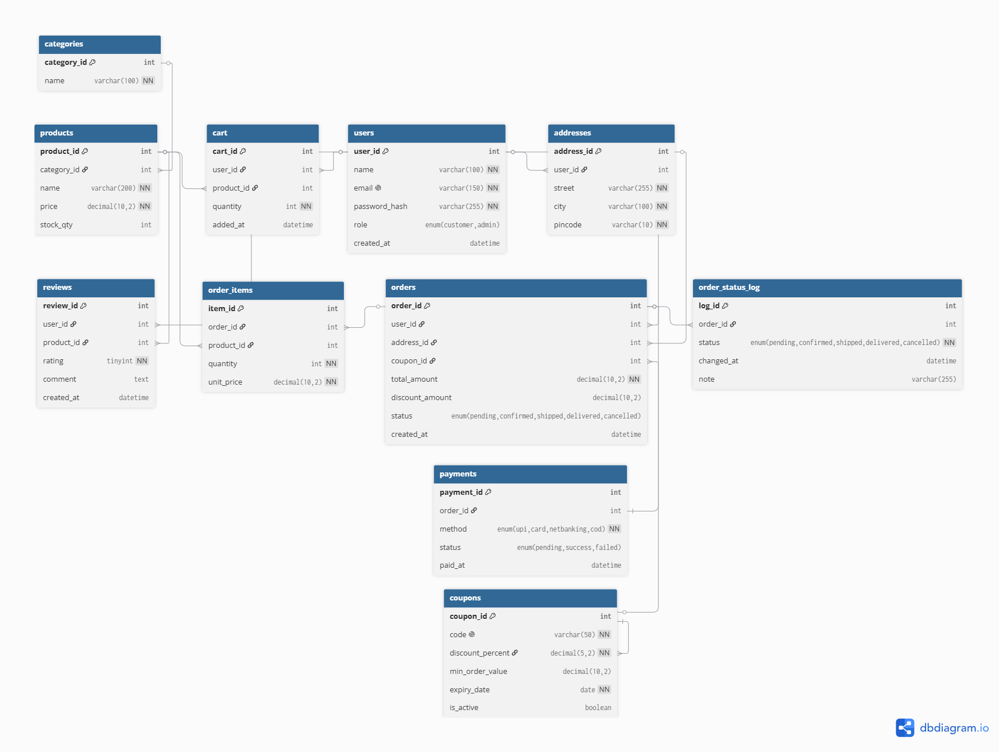

# E-Commerce Order Management System

A full-stack order management system built with MySQL and MongoDB,
demonstrating real-world DBMS concepts for SDE roles.

## Tech Stack
- MySQL (relational data — orders, users, payments)
- MongoDB (flexible product catalog)
- Node.js + Express (REST API)

## Database Schema

## Key Concepts Demonstrated
- 3NF normalization
- ACID transactions
- Indexing strategy
- Stored procedures & triggers
- Polyglot persistence (MySQL + MongoDB)

## Setup
...